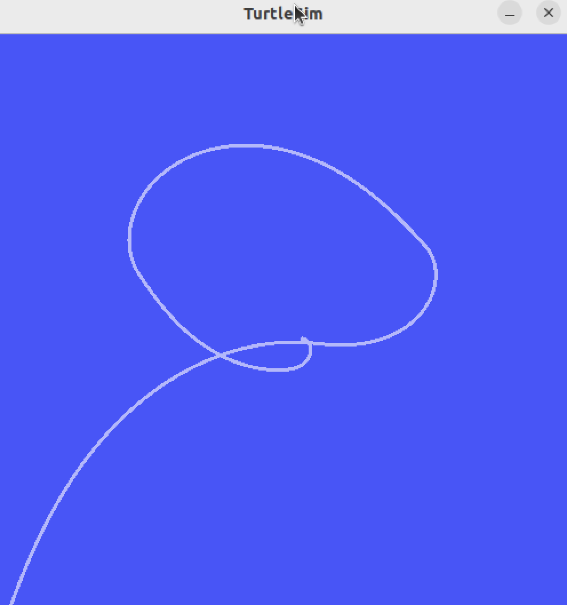

# Turtle Waypoint Navigator

ROS 2 C++ node that drives a turtlesim turtle through a list of waypoints using proportional control.

First project for learning ROS 2, C++, and Git.

## What it does

Subscribes to the turtle's pose, computes distance and heading to the current waypoint, and publishes velocity commands to drive toward it. Advances to the next waypoint once close enough, stops after the last one.

## Requirements

- ROS 2 Humble
- turtlesim

## Build

cd ~/ros2_ws
colcon build --packages-select turtle_waypoint_nav
source install/setup.bash

## Run

Terminal 1:
ros2 run turtlesim turtlesim_node

Terminal 2:
ros2 run turtle_waypoint_nav waypoint_nav

## Notes

- Waypoints are hardcoded in the constructor for now
- Uses angle normalization to avoid the turtle taking the "long way around" on turns
- Gains (linear/angular speed multipliers) are tuned by hand, not anything rigorous